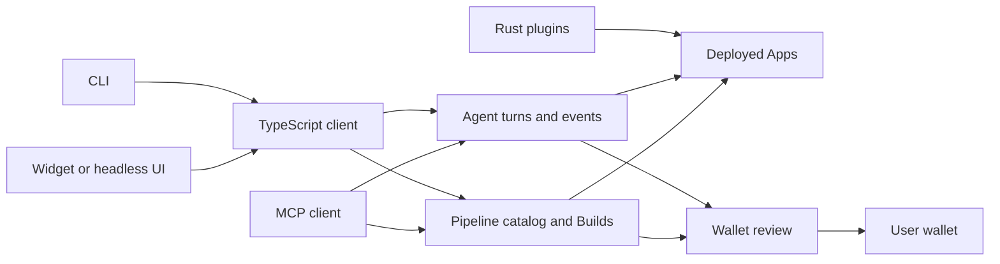

Aomi exposes the same Agent and Pipeline contracts through HTTP, MCP, and the TypeScript client. The CLI ships in `@aomi-labs/client`. The Rust SDK in `aomi-labs/aomi-sdk` is for authoring plugins deployed as Apps; it is not the TypeScript client or an HTTP client crate.

## Conversation and deterministic execution

Agent owns sessions and ordered events. Start a turn with a typed intent, follow its cursor, and show tool progress, Actions, and any durable Commit reviews. Pipeline carries a portable Build through stage, simulate, and explicit commit without a conversation. A Pipeline commit result can contain wallet requests; it is not itself proof of on-chain confirmation.

## Identity and authority

Caller authentication, App selection, per-user App credentials, and wallet authority are separate. Use exact-resource OAuth for delegated integrations and origin-bound widget sessions for browser embeds. Keep private keys and provider secrets out of browser configuration and prompts.

## Choose a developer surface

- [CLI reference](/docs/reference/cli) for terminal workflows.
- [TypeScript integration](https://aomi.dev/docs/integrate/client-sdk) for an existing product or service.
- [Rust SDK](/docs/reference/sdk) for plugin authoring.
- [API reference](/docs/build/services/api-reference) for raw HTTP.
- [Widget quickstart](/docs/build/quickstart) for a packaged browser UI.

Pin a package and use a compatible API origin. Merged source, published packages, and hosted deployments can advance independently.
