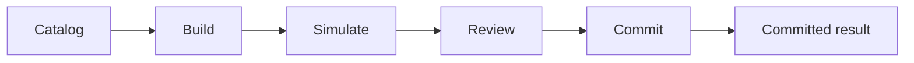

# Transaction simulation

Aomi's public Pipeline turns a typed operation into reviewable execution data.
Clients discover an operation, build its arguments, simulate the resulting
requests, present the evidence, and commit the reviewed payload.

## Stage or build

Use `POST /v1/pipeline/stage` to validate and stage an operation before
simulation. `POST /v1/pipeline/build` is the combined build path when the
client wants the complete build envelope directly.

The build envelope carries the normalized operation and the typed requests
that subsequent steps must preserve. Do not replace these fields with
caller-authored transaction data.

## Simulate

`POST /v1/pipeline/evm/simulate` or `POST /v1/pipeline/svm/simulate` executes the built requests against a safe
simulation environment. The response contains evidence such as asset changes,
approval changes, gas or fee estimates, logs, and guard results.

Simulation evidence is an input to review. It is not proof that a later commit
has succeeded, and it can become stale as chain state changes.

## Review and commit

Show the user the simulated operation and its effects before signing. Then
submit the preserved build payload through `POST /v1/pipeline/evm/commit` or
`POST /v1/pipeline/svm/commit`.

Successful portable preparation keeps the legacy `status: "committed"` response
label for compatibility and adds `preparation_status: "prepared"`, a `digest`,
and validated `requests` for the caller's wallet. `provider_invoked: false` means
the wallet has not yet signed or submitted anything. The caller submits the
requests and tracks receipts; this stateless path creates no durable Agent
Action or Commit Service operation.

Builds with an older `hmac-sha256:` attestation must be recreated through
`stage` and simulated again before commit. The server cannot recover required
review guards from that older attestation, so it will not reuse its verdict.
This affects transient portable Builds; existing durable Agent commits and
wallet attempts keep their stored lifecycle.

Portable SVM preparation supports a homogeneous instruction bundle or unsigned
transaction requests. It simulates each prepared transaction's exact bytes
independently; an ordered set whose later transactions depend on earlier state
changes is not supported by this stateless path.

Preparation errors include a stable `code`, `phase`, `retryable`, and
`next_required_action` so callers can distinguish a blocked review from a
wallet mismatch or temporary chain access failure. Provider credentials and
raw signed transaction payloads are not included in these errors.

When the same flow runs inside an Agent turn, the runtime represents the review
boundary as a durable Action. Resolve the Action at its current revision with
the typed result requested by the server.

## Authentication

Pipeline catalog reads use the `pipeline:catalog` scope. Execution routes use
`pipeline:execute`. Access tokens are exact-resource bound to
`https://chat.aomi.dev/v1/pipeline`; an Agent token is not interchangeable.

## Canonical references

- [Simulation response reference](https://aomi.dev/docs/reference/simulation-reference)
- [Transaction pipeline](https://aomi.dev/docs/concepts/transaction-pipeline)
- [Pipeline REST API](https://aomi.dev/docs/api-reference/pipeline)
- [Authentication](https://aomi.dev/docs/api-reference/authentication)
