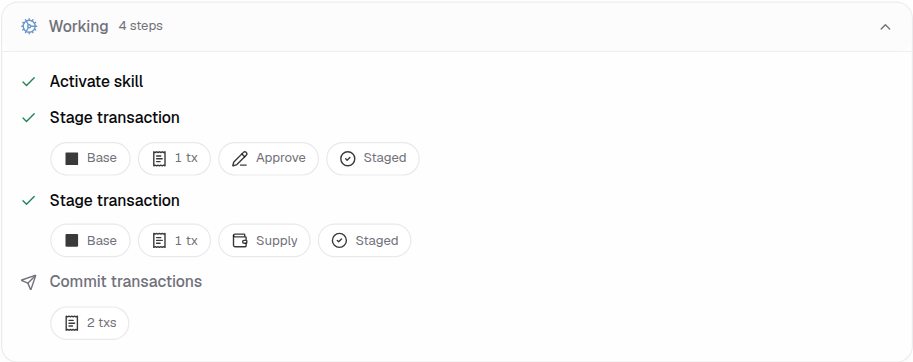

# Working Trace Presentation Contract

The shared widget presents tool calls in one chronological trace. Tool identity
selects an interpreter. The interpreter reads execution facts from the tool's
own arguments and result; the presenter owns the visible title, icon, chip order,
and state marker. Portal and embedded widgets consume the same implementation.

## Transaction lifecycle

EVM and Solana stage, simulate, and commit rows share the slot order:

1. Execution network, when the operation reports one.
2. Count or progress, using the correct unit (`tx`, `instruction`, or confirmed fraction).
3. One optional action or resource metric.
4. Current state.

The network, count, and state survive chip overflow. Missing facts leave their
slot empty. A simulation's internal steps are not transaction count. EVM
simulation uses `resolved_ids` (or the requested transaction ids before a
result); Solana instruction staging counts `ix_ids`, while simulation and
commit of an assembled instruction bundle count one transaction. Gas and
compute units are separate metrics.

`Staged`, `Passed`, `Awaiting approval`, `Awaiting signature`, `Submitted`,
`Confirmed`, `Incomplete`, and failure/cancellation states describe distinct
moments. A completed tool call may still have a waiting transaction; its row
marker remains pending. Commit rows use the returned Commit Service views for
state, network, transaction count, and partial confirmation progress.

The pictured commit is still running; it has a transaction count but no
completed-state marker.

## Names and protocol context

Declared core tool names resolve to stable action titles while active, after
success, and after errors. For example, `evm_stage_tx`, `svm_stage_ix`, and the
legacy `Evm stage` label show **Stage transaction**. Simulation, commit, web
search, skill activation, contract details, and contract calls follow the same
rule. Supported ERC-20 calls retain precise action titles such as **Read token
decimals**.

Protocol preparation has an explicit tool registration and result validation.
Aave preparation shows its operation, amount, network, approval requirement,
and prepared state; market and standalone token labels do not displace the
amount. LI.FI swap preparation keeps source and destination token and amount
details. A protocol payload never changes the structure or title of a core
transaction lifecycle row. Tool ownership attribution is independent of
presentation and must come from exact catalog declarations. Matching a
registered presentation also requires the full declared tool name; a
namespaced skill tool cannot borrow a core tool's presentation by suffix.

Unknown tools, including tools injected by a skill, show a readable tool title
and expandable details without inferred chain, token, amount, protocol, or
action chips. Real errors still show a failed state. Adding rich presentation
requires registering the tool identity and validating its result shape.

## Verification

`working-trace-contract.test.tsx` covers names, unknown tools, EVM and Solana
count units, incomplete simulations, commit progress, pending row markers,
and overflow. `tool-interpreter.test.ts` covers supported tool payloads.
`scripts/test-transaction-review-visuals.mjs` renders the shared trace in a
browser alongside the durable Aave review fixture and captures the image above.
The widget registry manifest must include every interpreter source dependency
before generating or packing the registry.
