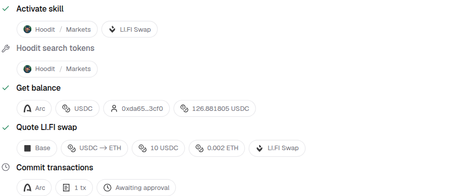
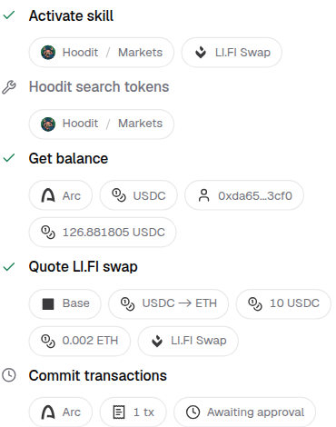

# App and skill attribution

App-owned skill activations display their structured `app/skill` identifier as
`App / Skill`, with a graphical slash and app artwork when the publisher identity
is known. Names and routing IDs remain separate. Main and delegated traces and
the activity sidebar share the attribution context and badge component.
On tool rows, network and transaction or quote facts appear first; ownership
badges follow them and never consume the data-chip limit.
The core `get_erc20_balance` result shows its network, verified token identity,
holder, and exact reported balance. Unknown token contracts show a shortened
address without an inferred symbol or unit.

Tool ownership is metadata-driven for every app:

- An app badge requires exact membership in its descriptor's
  `metadata.tool_names` array.
- A skill badge requires exact membership in the skill catalog's
  `injected_tools` array.
- Multiple declared owners are ambiguous and are not resolved by guessing.
- A tool-name prefix, protocol-specific result shape, current app selection or
  previously activated skill is not proof of ownership.

The `app/skill` namespace is used to display a skill activation that the backend
explicitly reported. It is never matched against a tool name to infer ownership.
Artwork comes from the existing app/skill icon registry; unknown/community or
ambiguous publishers retain a generic icon. No app-specific attribution branches
or per-app tool lists are maintained in the frontend.

## Hosted catalog limitation

The current hosted Hoodit descriptors have no `metadata.tool_names`, and Hoodit's
app-local skills are absent from `/api/resource/skills`. These tools therefore
remain untagged until the backend exposes their ownership. This is an explicit
data dependency, not a reason to infer ownership from `hoodit_`.

The backend's `AppSpec::from_manifest` already derives `tool_names` from the
compiled app manifest, but hosted discovery reconstructs descriptors from DB
registration metadata. A backend follow-up must expose the exact deployed
application's tool and injected-skill mappings, scoped by `application_id` and
release. Joining only on app name would be incorrect for duplicate publishers.
The frontend must not treat inherited/common tools as app-owned merely because
an app can call them. For ambiguous historical calls, per-call provenance is
needed to identify the supplier reliably.

## Verification

- The widget's 627 tests pass, including attribution, trace, and activity-sidebar
  coverage. Ownership requires exact declarations and stays absent when metadata
  is missing or ambiguous. Core transaction outcomes and account facts remain
  visible alongside attribution.
- The registry/package build, changed-file lint, and frontend dependency
  boundaries pass. No public props or host-provider requirements changed.
- A deterministic browser fixture checks desktop and 390px trace layouts,
  including badges, Arc transaction state, no decorative dots or text-only
  overflow bubbles, and no horizontal overflow in the narrow trace.
- The widget version advances from 3.0.8 to 3.0.9, and the shared attribution
  modules are included in the installable registry.

These screenshots use declared ownership in a fixture. They do not imply that
the hosted backend currently supplies Hoodit's tool metadata.

