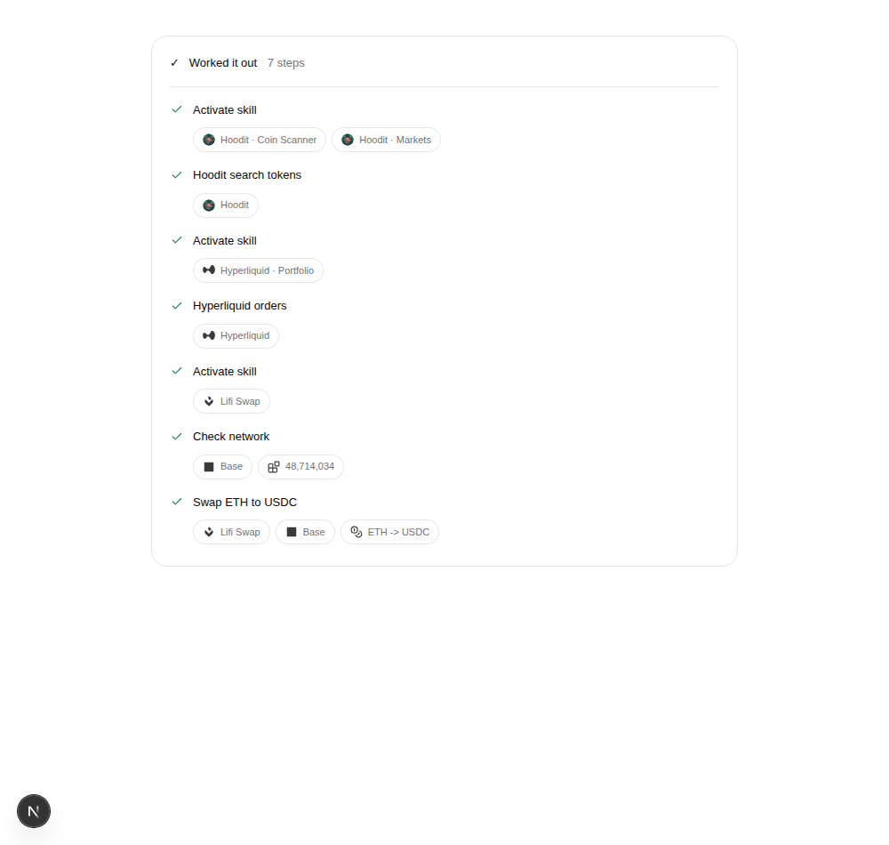
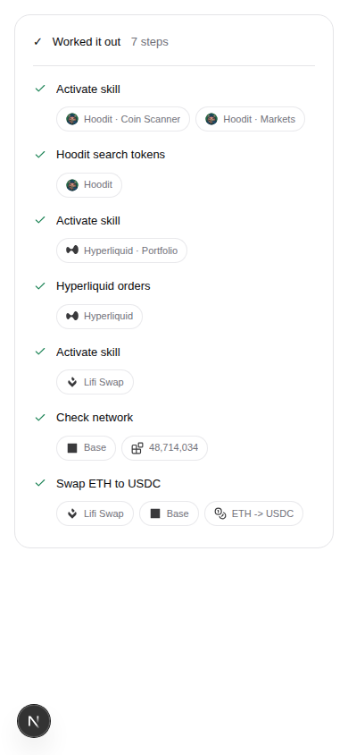

# Working-trace attribution

App-owned skills show a single `App · Skill` badge with the app artwork.
App tools use the app descriptor's exact `metadata.tool_names` membership;
injected tools use the skill catalog's exact `injected_tools` membership.
The same context feeds main and delegated trace rows. Pending activation uses
requested skill IDs; completed activation only displays accepted IDs.

Unknown artwork uses the existing generic app icon. Private/community
publishers retain their own identity, and ambiguous app or tool ownership does
not borrow another app's logo. Existing skill IDs and raw details remain
available for routing and inspection. Known LI.FI/Jupiter result shapes also
carry their skill badge on older transcripts with descriptive tool labels.
Generic network and transaction tools do not inherit the last activated skill.

The shared skill label formatter removes namespace prefixes for skill names.
Hoodit's original published icon is recorded in the app artwork source manifest.
The shipped widget package is bumped from 3.0.5 to 3.0.6; new modules are included
in the installable component registry.

## Verification

- 108 focused tests: interpreter, ownership, activation, mother/child rendering,
  app artwork/identity, and skill labels.
- Full repository lint, root TypeScript check, and frontend dependency boundaries.
- Library/client/React builds and widget registry/package build.
- Packed widget compatibility against trusted base `01a39487`: consumer production
  build, host-composition types, and package export resolution pass.
- Chromium at 1000px and 390px: real trace rows rendered in a temporary Landing
  fixture with deterministic results; no browser errors, no mobile overflow,
  and raw tool details opened successfully. This is UI fixture verification,
  not a live backend or wallet execution test.
- The optional full widget `tsc --noEmit` check reports 13 errors in untouched
  wallet tests: `activity-sidebar/wallet-review.test.tsx`,
  `control-bar/dual-wallet-bar.test.tsx`, `control-bar/wallet-picker.test.tsx`,
  and `lib/wallet-kit/execution/execution-runtime.test.ts`. No changed files
  are reported by that check. Production declaration generation passes.

