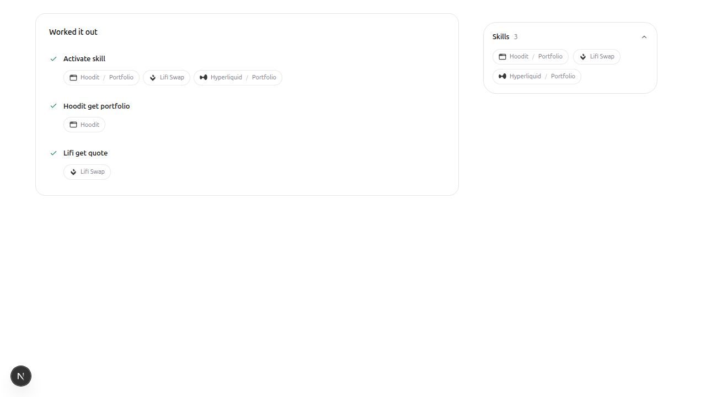

# App and skill attribution

App-owned skill activations display their structured `app/skill` identifier as
`App / Skill`, with a graphical slash and app artwork when the publisher identity
is known. Names and routing IDs remain separate. Main and delegated traces and
the activity sidebar share the attribution context and badge component.

Tool ownership is metadata-driven for every app:

- An app badge requires exact membership in its descriptor's
  `metadata.tool_names` array.
- A skill badge requires exact membership in the skill catalog's
  `injected_tools` array.
- Multiple declared owners are ambiguous and are not resolved by guessing.
- A tool-name prefix, protocol-specific result shape, current app selection or
  previously activated skill is not proof of ownership.

The `app/skill` namespace is used to display a skill activation that the backend
explicitly reported. It is never matched against a tool name to infer ownership.
Artwork comes from the existing app/skill icon registry; unknown/community or
ambiguous publishers retain a generic icon. No app-specific attribution branches
or per-app tool lists are maintained in the frontend.

## Hosted catalog limitation

The current hosted Hoodit descriptors have no `metadata.tool_names`, and Hoodit's
app-local skills are absent from `/api/resource/skills`. These tools therefore
remain untagged until the backend exposes their ownership. This is an explicit
data dependency, not a reason to infer ownership from `hoodit_`.

The backend's `AppSpec::from_manifest` already derives `tool_names` from the
compiled app manifest, but hosted discovery reconstructs descriptors from DB
registration metadata. A backend follow-up must expose the exact deployed
application's tool and injected-skill mappings, scoped by `application_id` and
release. Joining only on app name would be incorrect for duplicate publishers.
The frontend must not treat inherited/common tools as app-owned merely because
an app can call them. For ambiguous historical calls, per-call provenance is
needed to identify the supplier reliably.

## Verification

- 137 focused interpreter, attribution, trace and activity-sidebar tests pass.
  Coverage includes arbitrary new app names with unrelated tool names, exact
  declarations overriding misleading prefixes, missing/ambiguous metadata,
  injected skill ownership, identical sidebar/trace badges, and initial/live
  overflow-chip animation.
- Removed unused early screenshots and the obsolete sidebar skill-catalog mock.
- Changed-file lint passes. No public props or host-provider requirements changed.
- Widget registry/package build and packed-widget consumer compatibility are
  checked against trusted base `01a39487b957305b5267ba5be73b11669144f679`.
- The badge layout was checked at 1280px and 390px, with no horizontal overflow
  or console errors and working raw-detail expansion. The fixture held the
  sidebar at its settled width/opacity to avoid background-tab animation timing;
  live backend calls and animation timing were not part of that visual check.
- The widget version is bumped from 3.0.5 to 3.0.6, and all shared modules are
  included in the installable registry.

The screenshots below show badge presentation. They precede removal of the
namespace fallback: the Hoodit tool badge shown now requires explicit ownership
metadata and is not evidence that the hosted backend currently supplies it.

